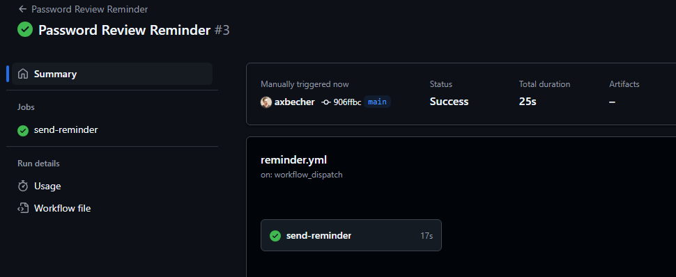
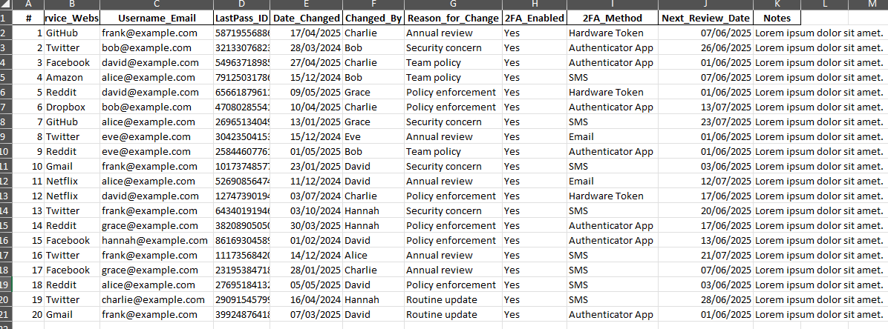

# 🔐 Password Checkup

This GitHub Action automates password security reviews by scanning an Excel file for upcoming password review dates and old passwords that haven’t been updated in a while. It sends a styled HTML email summary to configured recipients every 24 hours ( 10:00 AM Romanian Hour ).

---

## Table of Contents

1. [Features](#-features)
2. [Project Structure](#-project-structure)
3. [Screenshots](#️-screenshots)
4. [Setup Instructions](#-setup-instructions)
5. [GitHub Secrets Required](#-github-secrets-required)
6. [SMTP Configuration](#-smtp-configuration)
7. [Automation Schedule](#-automation-schedule)
8. [Email Preview](#-email-preview)
9. [Technologies Used](#-technologies-used)
10. [License](#-license)
11. [Contact](#-contact)


## 📋 Features

- ✅ Automatically checks an Excel file daily ( [data/data.xlsx](data/data.xlsx)  )
- ✅ Categorizes passwords:
  - Due within **1 day**
  - Due within **3 days**
  - Due within **1 week**
  - **Old passwords** that haven’t been updated in over 6 months
- ✅ Sends a **beautiful HTML email** with all matching entries
- ✅ Built with GitHub Actions, Python, and open-source tools

---

## 📁 Project Structure

```
.
├── .github/workflows/
│   └── reminder.yml             # GitHub Action: daily trigger
├── assets/
│   └── email_preview.gif         # An example of the email you’ll receive
│   └── github_action_run.png     # How it looks when the GitHub Action triggers
│   └── excel_data_preview.png     # How data looks
├── config/
│   └── email_recipients.yaml     # Email list
├── data/
│   └── data.xlsx                 # Main Excel file with password info
├── scripts/
│   └── send_email.py             # Main script that sends the email
├── requirements.txt              # Python dependencies
└── README.md                     # This file that you are reading right now
```

---

## 🖼️ Screenshots

### 📬 Email Preview
Here’s an example of the email you’ll receive:


### ⚙️ GitHub Action Run
This is how it looks when the GitHub Action triggers:


### ⚙️ Excel Data Preview
This is how data in excel looks:


---

## ⚙️ Setup Instructions

### 1. Clone this repository (private or public)

```bash
git clone https://github.com/axbecher/PasswordCheckup.git
cd PasswordCheckup
```

### 2. Configure your email list

Update the file: `config/email_recipients.yaml`

```yaml
recipients:
  - your.email@example.com
  - bob@example.org
```

### 3. Prepare the Excel file

Place your updated `data.xlsx` in the `data/` folder.

The file must include at least these columns (exactly):

- `Service_Website`
- `Next_Review_Date`
- `Date_Changed`
- `LastPass_ID`
- `Changed_By`

Use the format: **DD/MM/YYYY** for all date columns, in our case those are `Next_Review_Date` and `Date_Changed`.

---

## 🔐 GitHub Secrets Required

Go to **Settings > Secrets and variables > Actions** and add:

| Name             | Description                         |
|------------------|-------------------------------------|
| `EMAIL_USER`     | The email used to send notifications (e.g., system@domain.com) |
| `EMAIL_PASSWORD` | The SMTP password or app password for that email address         |

--- 

## 📡 SMTP Configuration

This project allows you to configure the SMTP host.

Go to [scripts/send_email.py](scripts/send_email.py#L128) and update:

| Name         | Description                                                  |
|--------------|--------------------------------------------------------------|
| `%SMTP_HOST%`  | SMTP server hostname (e.g., `mail.domain.com`, `smtp.gmail.com`) |

---

## 🔁 Automation Schedule

This project is set up to allow **manual triggering** by default via the **"Run workflow"** button in GitHub Actions.

If you'd like the workflow to run **automatically every 24 hours at 08:00 UTC**, you need to:

1. Open the file: [`/.github/workflows/reminder.yml`](.github/workflows/reminder.yml#L4)
2. Uncomment the `schedule` section:

```yaml
on:
  schedule:
    - cron: '0 8 * * *'  # runs daily at 08:00 UTC
  workflow_dispatch:
```
---

## 💌 Email Preview

The email contains:

- Summary per time frame (1 day, 3 days, 1 week, old passwords ( 90 days / 3 months ))
- Clean table format
- Footer with a link to [LastPass Vault](https://lastpass.com/vault/)

---

## ✅ Technologies Used

- Python 3.11
- Pandas
- openpyxl
- GitHub Actions
- SMTP

---

## 📄 License

This project is licensed under the [MIT License](LICENSE).

---

## 📬 Contact

Made with ❤️ by [Alexandru Becher](https://axbecher.com/contact)

For questions or improvements, feel free to open an [issue](https://github.com/axbecher/PasswordCheckup/issues) or [PR](https://github.com/axbecher/PasswordCheckup/pulls).
